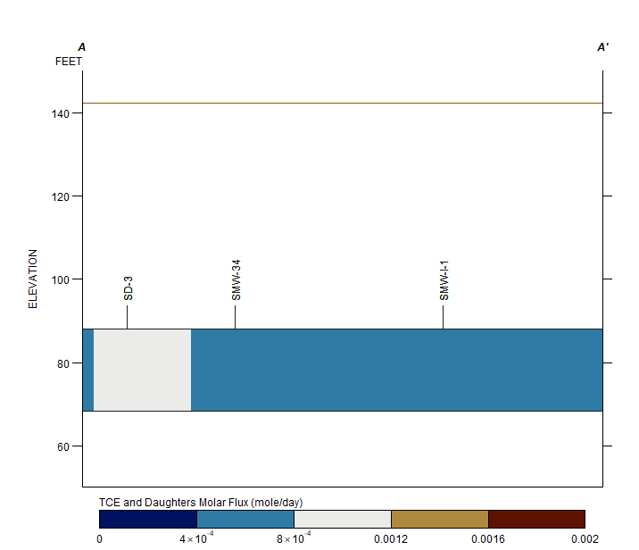
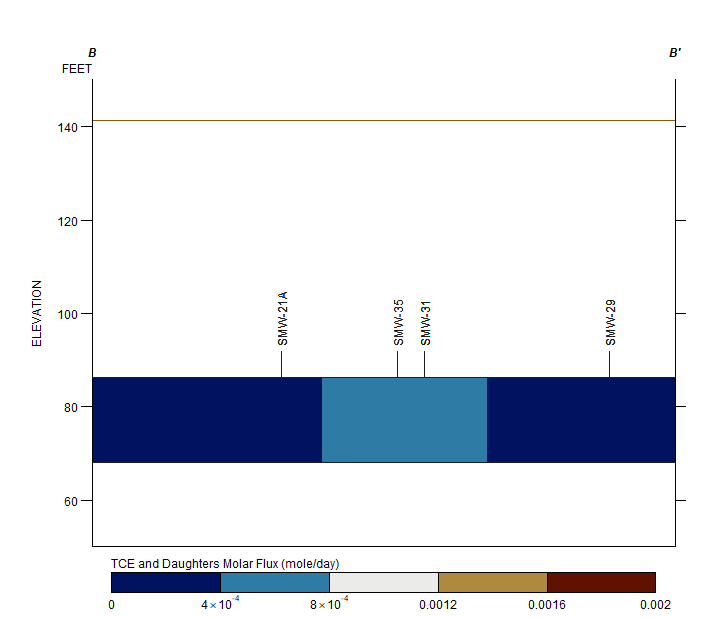
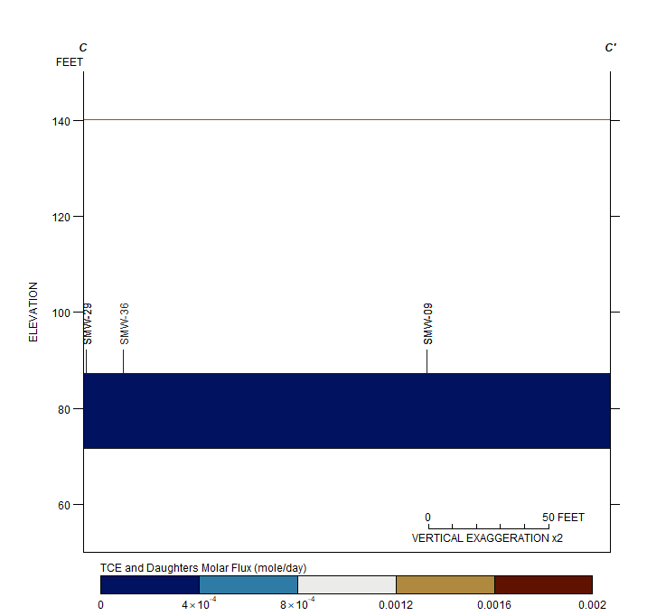

```{r setup, include=FALSE}
knitr::opts_chunk$set(echo = FALSE)

```

# Transect A

```{r transa, out.width = "100%"}


```

# Transect B


```{r transb, out.width = "100%"}

```

# Transect C


```{r transc, out.width = "100%"}

```